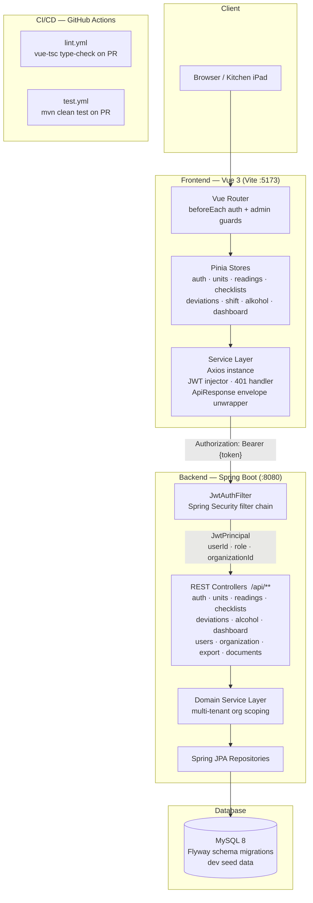
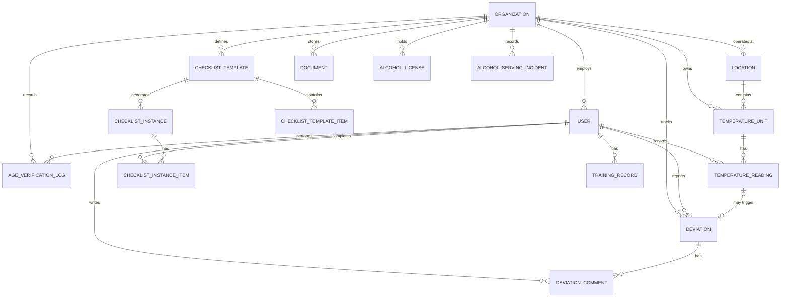
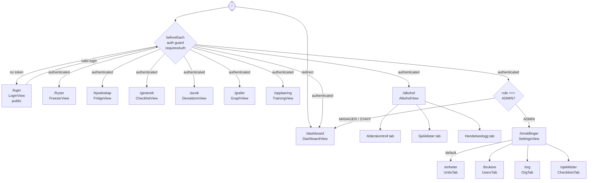
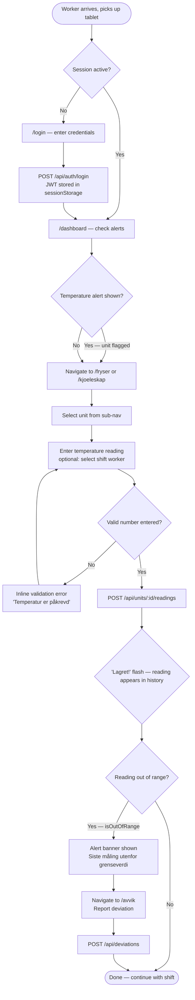
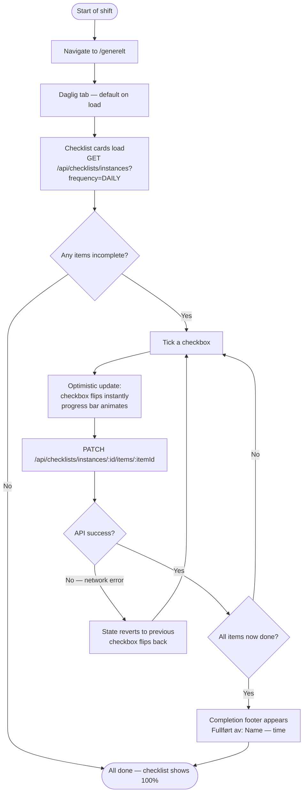
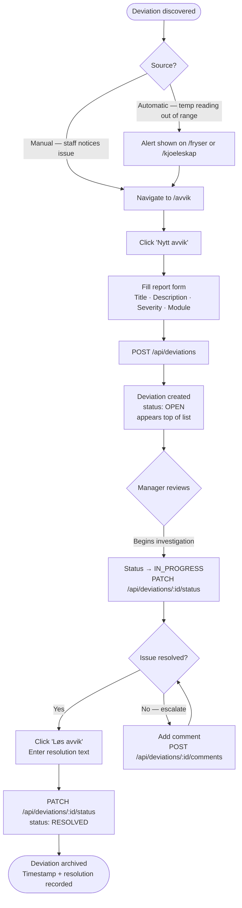
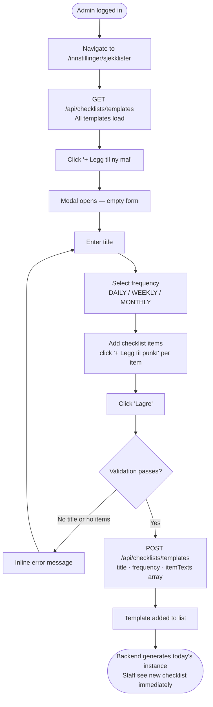
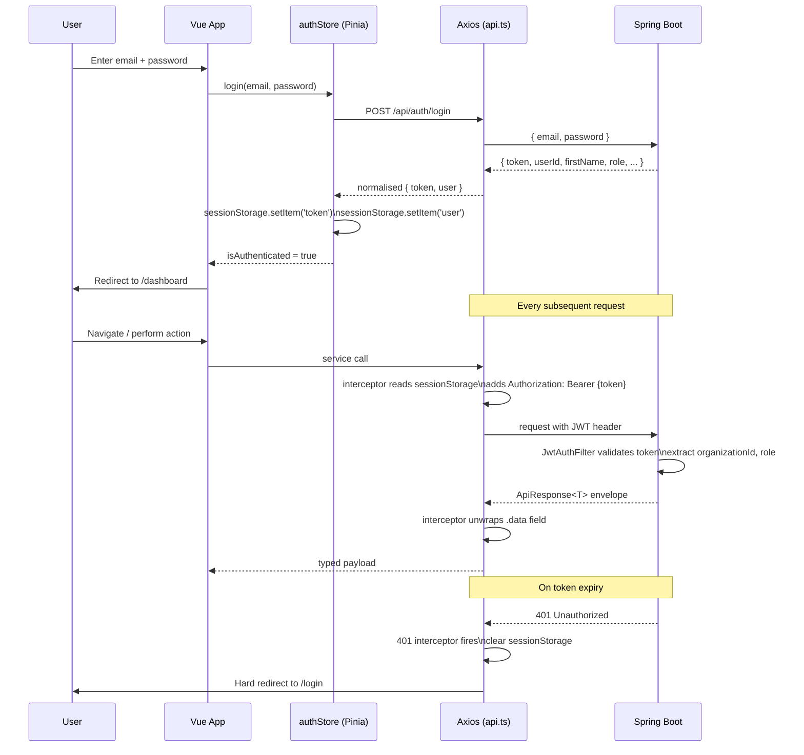

# Architecture Diagrams — IK-Kontrollsystem

All diagrams use [Mermaid](https://mermaid.js.org/) syntax. GitHub renders these natively in markdown files.

---

## 1. System Architecture

High-level view of how the full stack fits together — browser through to database.

---

## 2. Backend Domain Model

Entity relationships across the full backend domain.

---

## 3. Frontend Route Structure

All application routes, access guards, and which component renders at each path.

---

## 4. User Flow — Staff: Temperature Logging

Typical path when a kitchen worker logs a temperature reading at the start of a shift.

---

## 5. User Flow — Staff: Daily Checklist Completion

How a worker works through the daily opening checklist.

---

## 6. User Flow — Manager: Deviation Lifecycle

Full lifecycle of a reported non-conformance from discovery to resolution.

---

## 7. User Flow — Admin: Setting Up a New Checklist Template

How an administrator creates a checklist that staff will use going forward.

---

## 8. Authentication and Session Flow

How the JWT session is established, maintained, and terminated.

